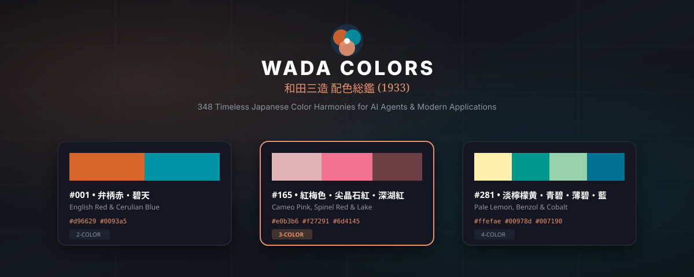

# 🌸 Wada Colors (和田三造 配色)
> **348 Timeless 1930s Japanese Color Harmonies for AI Agents & Modern Applications**  
> *Transforming Sanzo Wada's classic "A Dictionary of Color Combinations" (Haishoku Sōkan) into universal AI agent skills that create and update production-grade `design.md` systems.*

[](https://github.com/wada-colors/wada-colors/actions/workflows/ci.yml)
[](LICENSE)
[](#the-348-palettes)
[](#historical-provenance)
[](#strict-palette-preservation--wcag-bridge)
[](#supported-agents--quick-install)
[](#interactive-web-visualizer)

<p align="center">
  
</p>

---

## ✨ Why Wada Colors?

Modern web design has fallen into a trap of generic blue-and-purple gradients and sterile neutral templates. In 1933, Japanese artist and master color theorist **Sanzo Wada (和田三造)** published *Haishoku Sōkan* (配色総鑑) — a monumental study of **348 color combinations** blending traditional Japanese aesthetics with early Showa-era modernism.

**Wada Colors** brings this timeless mastery directly into your AI agent workflows (Claude Code, Cursor, Google Antigravity, Windsurf, Roo Code, GitHub Copilot). With a single command, your agent gains the knowledge to curate, harmonize, and generate production-grade `design.md` specifications tailored to your brand.

```
       [ Sanzo Wada 1933 Combinations ]
                       │
       ┌───────────────┴───────────────┐
       ▼                               ▼
[ Greenfield Apps ]       [ Brand Asset Ingestion ]
(Domain & Vibe Match)      (CIELAB ΔE Color Match)
       └───────────────┬───────────────┘
                       ▼
       [ 5-Step Curated Agent Interview ]
                       │
                       ▼
         [ Production-Grade design.md ]
     Strict Wada Tokens • WCAG AAA Bridge
       CSS Variables • Tailwind v4 @theme
```

---

## ⚡ Quick Start: Install into Your Project

Install the Wada Colors skill into your project using the zero-dependency CLI:

```bash
# Interactive selection menu
npx wada-colors init

# Or install directly for your specific agent:
npx wada-colors init --agent claude        # .claude/skills/wada-colors/
npx wada-colors init --agent cursor        # .cursor/rules/wada-colors.mdc
npx wada-colors init --agent antigravity   # .agents/skills/wada-colors/
npx wada-colors init --agent windsurf      # .windsurf/rules/wada-colors.md
npx wada-colors init --agent roo           # .clinerules
npx wada-colors init --agent copilot       # .github/copilot-instructions.md

# Or install for all agents at once:
npx wada-colors init --agent all
```

---

## 🔍 Brand & Asset Color Matcher

Already have a primary brand color or logo? Wada Colors uses **CIELAB Delta-E ($\Delta E$) perceptual color science** to find authentic 1930s Wada harmonies that anchor and elevate your existing identity:

```bash
# Match directly from a hex color:
npx wada-colors match --color "#2A6F97"

# Or extract automatically from brand asset files (JSON, SVG, or CSS):
npx wada-colors match --file ./brand.json
npx wada-colors match --file ./logo.svg
npx wada-colors match --file ./src/theme.css
```

**Example Output:**
```text
🌸 Closest authentic Wada pigment to #2A6F97:
   #121 群青 (Gunjō) / Olympic Blue
   Hex: #5a82b3 | CIELAB ΔE: 8.42 (0 = identical)

🌟 Top Wada Sanzo Combinations anchoring your brand color:
  [1] Combination #121: 浅葱青・生成色・群青 (Nile Blue & Ecru & Olympic Blue)
      Size: 3-color | Temperature: balanced
      Colors: #bce4e5 + #c2ae93 + #5a82b3
      Tags: trio, balanced, surface-accent, tranquil, oceanic
```

---

## 🤖 The 5-Step Guided Agent Workflow

Once installed, your AI agent follows a disciplined, curated workflow whenever you ask it to create or update `design.md`:

```
Step 1: Profiling & Ingestion  ──► Checks brand files/hex or asks 4 quick archetype questions
                                    │
Step 2: 3-Candidate Showcase   ──► Presents 3 curated Wada palettes with rationale & swatches
                                    │
Step 3: Strict Token Mapping   ──► Preserves exact Wada hex codes + neutral monochrome bridge
                                    │
Step 4: design.md Synthesis    ──► Writes complete production specification in project root
                                    │
Step 5: Code Tokens Export     ──► Writes theme.css, tailwind.config, or tokens.json
```

### Try these prompts with your AI Agent:

> *"Generate a design.md for our developer tools CLI app using Wada Sanzo colors."*

> *"Here is our brand color `#E07A5F`. Find a matching Wada Sanzo combination and update our design.md."*

> *"Update our design system with a 3-color Wada Sanzo palette that feels like Zen Wabi-Sabi."*

---

## 🎨 Strict Palette Preservation & WCAG Bridge

Wada Colors enforces a strict design principle: **Never morph, desaturate, or artificially alter authentic Wada Sanzo colors.**

Instead, the skill pairs the authentic Wada palette with an **intelligent neutral monochrome bridge**:

| UI Layer | Light Mode | Dark Mode | WCAG Compliance |
|---|---|---|---|
| **Canvas Background** | `#fcfbf9` (Washi Ivory) | `#111314` (Deep Carbon) | Baseline |
| **Card Surface** | `#ffffff` (Elevated Panel) | `#1a1e24` (Obsidian Surface) | Structural |
| **Primary Text** | `#111314` (Sumi Ink) | `#f5f5f7` (Crisp Off-White) | **>15:1 (AAA)** |
| **Secondary Text** | `#64748b` (Readable Slate) | `#94a3b8` (Muted Slate) | **>5.2:1 (AA)** |
| **Wada Hero Color** | Pure Wada Hex | Pure Wada Hex | Brand Identity |
| **Button Text** | Dynamic Inverted | Dynamic Inverted | **>4.5:1 (AA)** |

---

## 🌐 Interactive Web Visualizer & Live App Mockup

This repository includes a **zero-build interactive web gallery** ready to deploy on **GitHub Pages**:

- **348 Palette Grid**: Instant search by name, Japanese kanji, hex, mood, or archetype.
- **Brand Color Matcher**: Native color picker + hex input with real-time CIELAB Delta-E ranking.
- **Live App UI Mockup**: An interactive, responsive application interface (Navbar, Hero section, Feature cards, CTA buttons) that dynamically recolors on-the-fly as you select palettes!
- **Interactive Light / Dark Mode**: Toggle the live mockup between light and dark modes to preview how the palette performs.
- **One-Click Code Export**: Copy CSS custom properties (`:root`), Tailwind CSS v4 `@theme`, `design.md` snippet, or agent prompt with one click.

### Running the Visualizer Locally:
```bash
npm run serve
# Visit http://localhost:3333
```

---

## 📚 The 348 Palettes at a Glance

Sanzo Wada's dictionary is systematically divided into three palette densities:

### 1. 2-Color Duos (#1 – #120)
*Ideal for minimalist developer tools, terminal interfaces, high-contrast branding, and dual-tone landing pages.*
- **#1**: English Red (`#d96629`) & Cerulian Blue (`#0093a5`) — *弁柄赤・碧天*
- **#14**: Raw Sienna (`#bb7125`) & Deep Slate Olive (`#253122`) — *黄土色・石盤橄欖*
- **#28**: Brick Red (`#a84222`) & Peacock Blue (`#00939b`) — *弁柄色・孔雀青*

### 2. 3-Color Trios (#121 – #240)
*Ideal for SaaS dashboards, mobile apps, web platforms (Dominant, Secondary, Accent).*
- **#161**: Brown (`#7c4226`), Pinkish Cinnamon (`#eeb480`) & Helvetia Blue (`#005b8d`) — *茶色・肉桂色・露草色*
- **#165**: Cameo Pink (`#e0b3b6`), Spinel Red (`#f27291`) & Vistoris Lake (`#6d4145`) — *紅梅色・尖晶石紅・深湖紅*
- **#176**: Hermosa Pink (`#f9c1ce`), Dark Tyrian Blue (`#12354e`) & Warm Gray (`#a1a39a`) — *肉色・鉄紺・灰桜*

### 3. 4-Color Quads (#241 – #348)
*Ideal for rich editorial publications, artisan lifestyle, e-commerce, and multi-tag categorizations.*
- **#241**: Slate Color (`#34454c`), Benzol Green (`#00978d`), Cream Yellow (`#fdbf68`) & Brown (`#7c4226`)
- **#281**: Pale Lemon Yellow (`#ffefae`), Benzol Green (`#00978d`), Cobalt Green (`#96d1aa`) & Antwarp Blue (`#007190`)
- **#312**: Deep Indigo (`#051230`), Peach Red (`#f15a30`), Cream Yellow (`#fdbf68`) & White (`#ffffff`)

---

## 🛠️ CLI Reference

```text
🌸 Wada Colors CLI (和田三造 配色)

Commands:
  npx wada-colors init [--agent <claude|cursor|antigravity|windsurf|roo|copilot|all>]
  npx wada-colors list [--size <2|3|4>]
  npx wada-colors search <keyword>
  npx wada-colors show <id (1-348)>
  npx wada-colors match --color "#HEX"
  npx wada-colors match --file <brand.json | logo.svg | theme.css>
  npx wada-colors generate --combo <id> [--name "App Name"] [--out design.md]
  npx wada-colors generate --color "#HEX" [--name "App Name"] [--out design.md]
  npx wada-colors help
```

---

## 🏛️ Historical Provenance

**Sanzo Wada (和田 三造, 1883–1967)** was an avant-garde Japanese painter, teacher, and kimono designer. In 1927, he founded the Japan Standard Color Association (precursor to the Japan Color Research Institute). In 1933–1934, he published the landmark multi-volume *Haishoku Sōkan* (A Dictionary of Color Combinations), documenting traditional Japanese pigments alongside modern Western color theory. In 1954, Wada won the **Academy Award for Best Costume Design** for the film *Gate of Hell* (地獄門), celebrating his mastery of historical Japanese color palettes on the world stage.

---

## 📄 License & Attribution

- **Dataset & Code**: Released under the [MIT License](LICENSE).
- **Original Color Harmonies**: Sanzo Wada (1883–1967), *Haishoku Sōkan* (1933).
